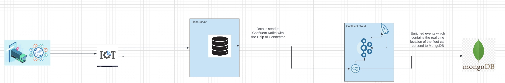
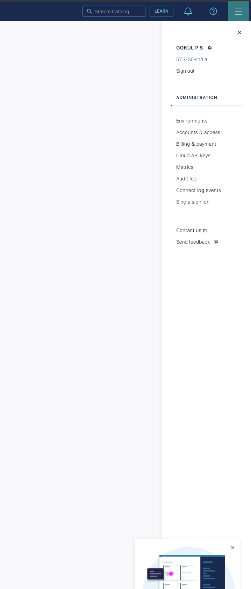
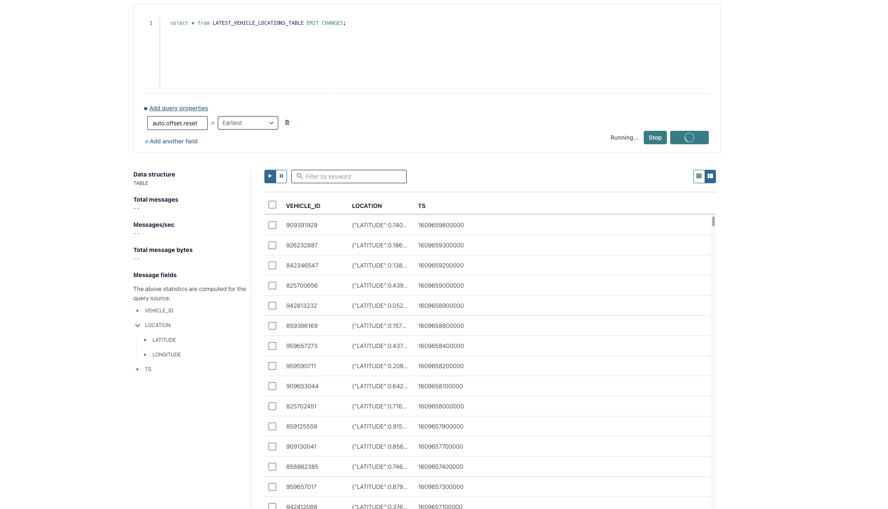
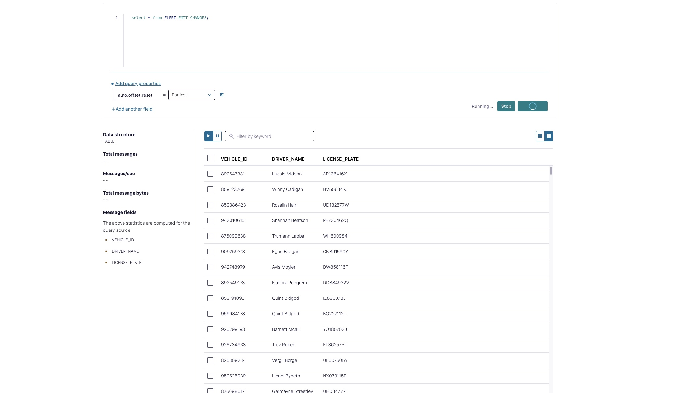
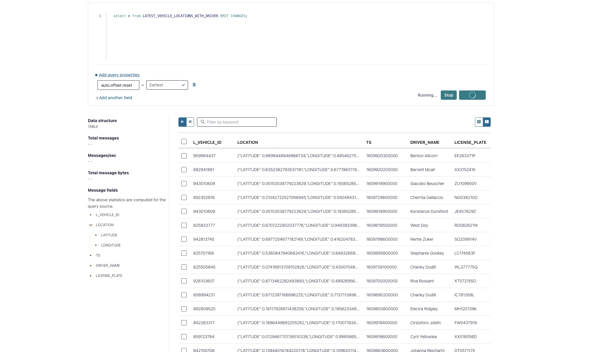
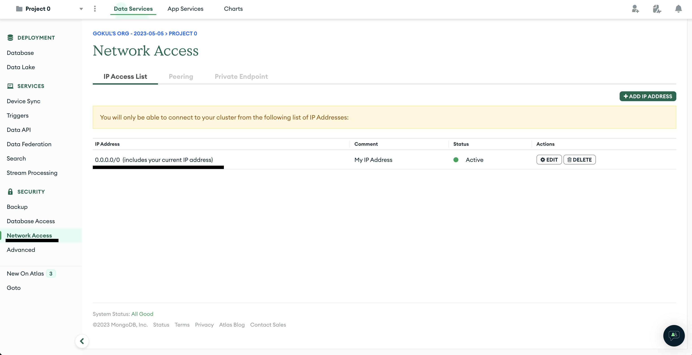
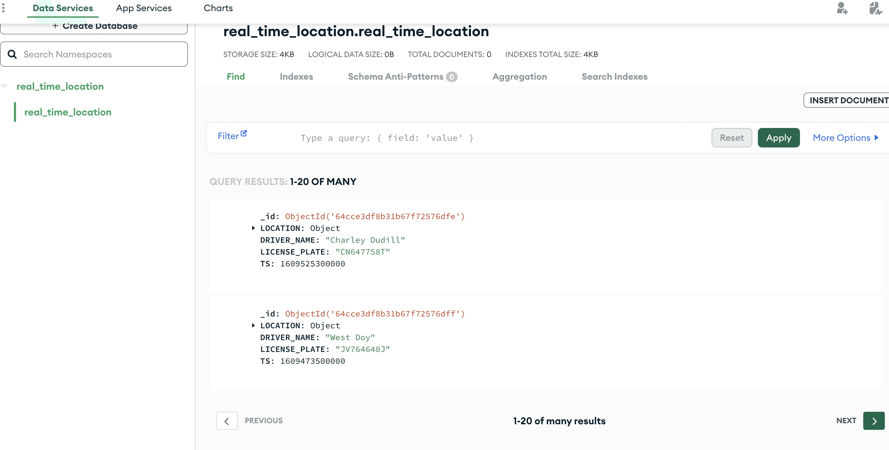
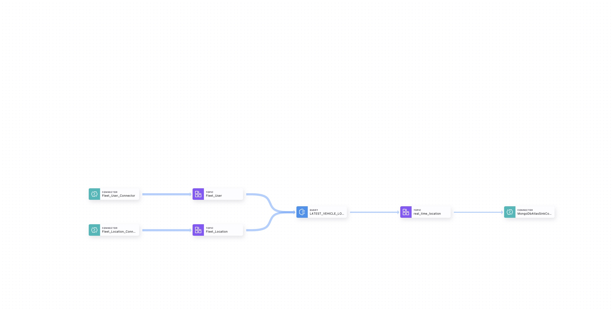

# Real Time Fleet Management

Real-time fleet management systems have become increasingly important in recent years, as businesses seek to optimize their fleet operations and improve customer service. Confluent Cloud, a fully-managed event streaming platform powered by Apache Kafka, provides a powerful solution for real-time fleet management. By leveraging Confluent Cloud's capabilities, businesses can collect and analyze data from their fleet in real-time, enabling them to make informed decisions and take proactive actions to improve efficiency, reduce costs, and enhance customer satisfaction. This Demo will explore the benefits of using Confluent Cloud for real-time fleet management and provide insights into how it can help businesses achieve their goals.

This demo involves the ingestion of simulated fleet data using the data gen connector into confluent cloud. The goal is to obtain real-time fleet positions, along with driver IDs and latitude/longitude details with the help of KSQLDB. Finally, the data will be sinked to MongoDB Atlas using a sink connector.

## Architecture Diagram

In this demonstration, we will be using the data gen connector to generate mock events for fleet users (driver details) and IoT sensor location events for each driver. Using KSQLDB, we will create a table that provides real-time fleet positions, along with driver and other fleet-related details. Finally, we will use the Mongo Atlas Sink Connector to send these events back to MongoDB for real-time monitoring.

<div align="center"> 
  
</div>


# Requirements

In order to successfully complete this demo you need to install few tools before getting started.

- If you don't have a Confluent Cloud account, sign up for a free trial [here](https://www.confluent.io/confluent-cloud/tryfree).
- Install Confluent Cloud CLI by following the instructions [here](https://docs.confluent.io/confluent-cli/current/install.html).
- Please follow the instructions to install Terraform if it is not already installed on your system.[here](https://developer.hashicorp.com/terraform/tutorials/aws-get-started/install-cli)  
  
  

## Prerequisites

### Confluent Cloud

1. Sign up for a Confluent Cloud account [here](https://www.confluent.io/get-started/).
1. After verifying your email address, access Confluent Cloud sign-in by navigating [here](https://confluent.cloud).
1. When provided with the _username_ and _password_ prompts, fill in your credentials.

   > **Note:** If you're logging in for the first time you will see a wizard that will walk you through the some tutorials. Minimize this as you will walk through these steps in this guide.

1. Create Confluent Cloud API keys by following the steps in UI.Click on the button that is present on the right top section and click on Cloud API Key.
<div align="center"> 
  
</div>

 Now Click Add Key to generate API keys and store it as we will be using that key in this demo.
 <div align="center"> 
  
</div>
    
   > **Note:** This is different than Kafka cluster API keys. 

## MongoDB Atlas

1. Sign up for a free MongoDB Atlas account [here](https://www.mongodb.com/).

## Setup

1. This demo uses Terraform  to spin up resources that are needed.

2. Update the `terraform/variables.tf` file for the following variables with your Cloud API credentials.

```
variable "confluent_cloud_api_key" {
  
  default = " Replace with your API Key created during pre-requsite"   
}

variable "confluent_cloud_api_secret" {
  default = "Replace with your API Key created during pre-requsite"   
}
```
 ### Build your cloud infrastructure

1. Navigate to the repo's terraform directory.
   ```bash
   cd terraform
   ```

1. Initialize Terraform within the directory.
   ```
   terraform init
   ```

1. Apply the plan to create the infrastructure.

   ```
   terraform apply 
   ```

   > **Note:** Read the `main.tf` configuration file [to see what will be created](./terraform/main.tf).


 # Demo


## Enrich Data Streams with ksqlDB

Now that you have data flowing through Confluent, you can now easily build stream processing applications using ksqlDB. You are able to continuously transform, enrich, join, and aggregate your data using simple SQL syntax. You can gain value from your data directly from Confluent in real-time. Also, ksqlDB is a fully managed service within Confluent Cloud with a 99.9% uptime SLA. You can now focus on developing services and building your data pipeline while letting Confluent manage your resources for you.

<B>This Section invloves creation of KTable which provides us the real time postion of a fleet along with other fleet details for monitoring.<B>

If you’re interested in learning more about ksqlDB and the differences between streams and tables, I recommend reading these two blogs [here](https://www.confluent.io/blog/kafka-streams-tables-part-3-event-processing-fundamentals/) and [here](https://www.confluent.io/blog/how-real-time-stream-processing-works-with-ksqldb/).

1. On the navigation menu click on **ksqlDB** and step into the cluster you created during setup.
   To write streaming queries against topics, you will need to register the topics with ksqlDB as a stream or table.

2. **VERY IMPORTANT** -- at the bottom of the editor, set `auto.offset.reset` to `earliest`, or enter the statement:

   ```SQL
   SET 'auto.offset.reset' = 'earliest';
   ```

   If you use the default value of `latest`, then ksqlDB will read form the tail of the topics rather than the beginning, which means streams and tables won't have all the data you think they should.

3. Create a ksqlDB table from `Fleet_Location` topic.


 ```SQL
 CREATE TABLE latest_vehicle_locations_table (
 vehicle_id INT PRIMARY KEY,
 location STRUCT<latitude DOUBLE ,longitude DOUBLE>,
 ts BIGINT
 )  
  WITH (
    KAFKA_TOPIC='Fleet_Location',
    VALUE_FORMAT='JSON') ;

 ```
 
 
4. Use the following statement to query `latest_vehicle_locations_table ` table to ensure it's being populated correctly.

```SQL
   SELECT * FROM latest_vehicle_locations_table EMIT CHANGES;
   ```
Stop the running query by clicking on **Stop**.

<div align="center"> 
  
</div>

5. Create ` fleet ` table based on the `Fleet_User` topic you just created.The table is updated in real-time every time there is a change in driver details and driver fleet id generated by datagen connector.


 ```SQL
 CREATE TABLE fleet 
( vehicle_id INT PRIMARY KEY, driver_name VARCHAR, license_plate VARCHAR ) 
WITH 
( KAFKA_TOPIC = 'Fleet_User', VALUE_FORMAT = 'JSON


 ```

6. Use the following statement to query `fleet` table to ensure it's being populated correctly.

   ```SQL
   SELECT * FROM fleet EMIT CHANGES;
   ```
Stop the running query by clicking on **Stop**.
<div align="center"> 
  
</div>


7.Create  ` latest_vehicle_locations_with_driver` with the help of two tables created above by using join operation.this table will have the real time location details for a fleet along with driver and other neccessary details

```SQL
 CREATE TABLE latest_vehicle_locations_with_driver  with (kafka_topic = ‘real_time_location’) AS
  SELECT L.vehicle_id,
         L.location,
         L.ts,
         F.driver_name,
         F.license_plate
  FROM latest_vehicle_locations_table L
  LEFT JOIN fleet F
  ON L.vehicle_id = F.vehicle_id
  WHERE F.driver_name IS NOT NULL
  EMIT CHANGES;


 ```
8. Use the following statement to query `latest_vehicle_locations_with_driver ` table to ensure it's being populated correctly.

   ```SQL
   SELECT * FROM latest_vehicle_locations_with_driver  EMIT CHANGES;
   ```
Stop the running query by clicking on **Stop**.
<div align="center"> 
  
</div>

## Sinking Events from Confluent Cloud to MongoDB Cluster Using MongoDB Sink Connector

You can create  Sink connector either through CLI or Confluent Cloud web UI.

<details>
    <summary><b>CLI</b></summary>

1. Run the following command to create the  Sink connector.

   ```bash
   confluent connect cluster create --config-file confluent/connect_config.json
   ```

**Note:** Before executing the command, substitute the connect properties with the filename that you are using.

</details>
<br>

<details>
    <summary><b>Confluent Cloud Web UI</b></summary>

1. On the navigation menu, select **Connectors** and **+ Add connector**.
1. In the search bar search for your connector and select the Mongo Sink Atlasconnector.
1. Create a new  Mongo Atlas  Sink connector and complete the required fields like server and login details.
1. For Demo purposes ensure that MongoCluster is public by adding 0.0.0.0/0  in Network Access Section.
   <div align="center"> 
  
</div>

</details>
<br>

Once the connector is in **Running** state navigate to your MongoDB Atlas Connector and verify messages are showing up correctly.

<div align="center"> 
  
</div>

<div align="center"> 
  
</div>


Refer to our [documentation](https://www.confluent.io/product/connectors/) for detailed instructions about the  connector that are available.

## Congratulations


# Teardown

You want to delete any resources that were created during the demo so you don't incur additional charges.


## Infrastructure

1. Run the following command to delete all resources created by Terraform
   ```bash
   terraform apply -destroy

## Confluent Cloud Stream Governance

Confluent offers data governance tools such as Stream Quality, Stream Catalog, and Stream Lineage in a package called Stream Governance. These features ensure your data is high quality, observable and discoverable. Learn more about **Stream Governance** [here](https://www.confluent.io/product/stream-governance/) and refer to the [docs](https://docs.confluent.io/cloud/current/stream-governance/overview.html) page for detailed information.

1.  Navigate to https://confluent.cloud
1.  Use the left hand-side menu and click on **Stream Lineage**.
    Stream lineage provides a graphical UI of the end to end flow of your data. Both from the a bird’s eye view and drill-down magnification for answering questions like:

    - Where did data come from?
    - Where is it going?
    - Where, when, and how was it transformed?

In our use case, the stream lineage appears as follows: we utilize two datagen connectors  to generate events that are sent to two topics. These events are then enriched using KSQLDB with the assistance of a KTable, where the Real time Fleet information  is calculated. This Calcuated real time events are stored in "real_time_location" topic from where data is sinked to MongoDB with the help of sink connector


<div align="center"> 
  
</div>
   


# References

1. Connectors for Confluent Cloud [doc](https://docs.confluent.io/platform/current/connect/index.html)

2. Peering Connections in Confluent Cloud [doc](https://docs.confluent.io/cloud/current/networking/peering/index.html)
3. ksqlDB [page](https://www.confluent.io/product/ksqldb/) and [use cases](https://developer.confluent.io/tutorials/#explore-top-use-cases)
4. Stream Governance [page](https://www.confluent.io/product/stream-governance/) and [doc](https://docs.confluent.io/cloud/current/stream-governance/overview.html)
5.  MongoDB Atlas Sink Connector for Confluent Cloud [doc](https://docs.confluent.io/cloud/current/connectors/cc-mongo-db-sink.html)

  
